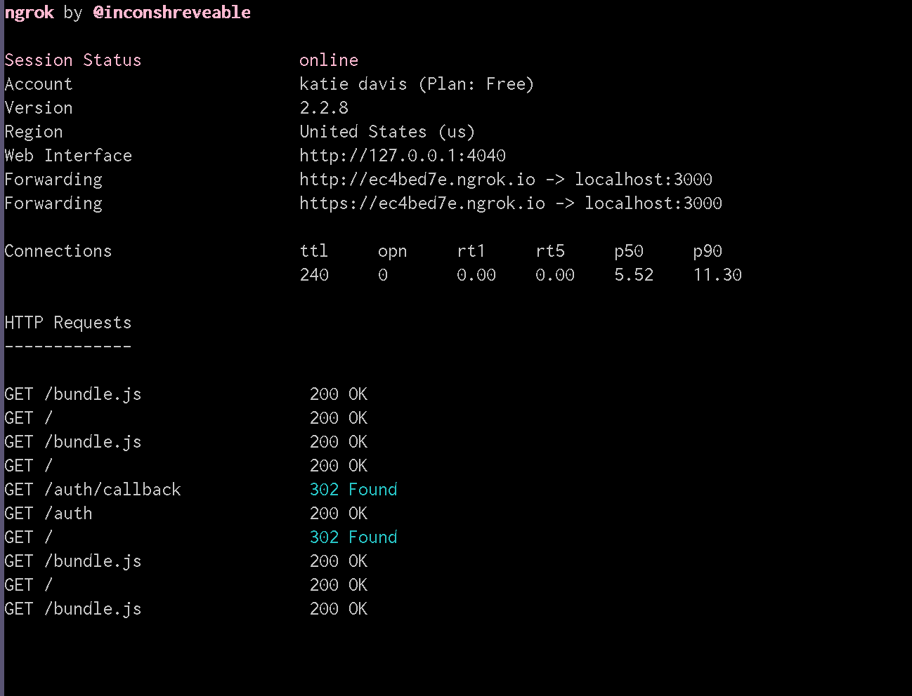

# Building our app

Now that we have laid the ground work for our app, lets build a way to run it!
In order to do that, we need to add some scripts to our `package.json` file.

```
 "scripts": {
   "test": "echo \"Error: no test specified\" && exit 1",
   "dev": "nodemon --exec babel-node index.js",
   "start": "yarn run dev"
 },
```

For now, **start** is going to run **dev**, and dev is going to look at
`index.js` in the root for instruction and use _nodemon_ to automatically
restart the node application when file changes in the directory are detected.

---

### Creating our server

Create a `server` folder and inside that an `index.js` file:

ie: `./server/index.js`

Remember that API key and secret we est up in our `.env` file? We're finally
going to use them!

In `./server/index.js`:

```
import dotenv from 'dotenv';

dotenv.config();
```

FYI - config will read your `.env` file, parse the contents, assign it to
process.env,and return an Object with a parsed key containing the loaded content
or an error key if it failed.

Next, we're going to add a packaged called Koa to our project

`yarn add koa`

Koa is a minimalistic node framework for modern Javascript apps. It is built
around the ES2016 `async` and `await` keywords.

In Koa you express your application logic as a series of asynchronous functions
called middleware, which is just a fancy word for functions that all operate on
a `context` or `ctx` object, and await on a `next` function to yield flow back
into the rest of the app.

Lets console.log a simple ‘Hello Friends’ middleware to make sure everything is
working. More documentation can be found in the
[Koa documentation](https://github.com/koajs/koa#hello-koa)

```
import dotenv from 'dotenv';
import Koa from 'koa';

dotenv.config();

const app = new Koa();

app.use(function index(ctx) {
 console.log('Hello Friends 👋');
 ctx.body = 'Hello Friends 👋';
});

export default app;
```

(ADD INSTRUCTIONS HERE ON WHERE THIS CAN BE FOUND)

Now, lets add an `index.js` file at the root level of our project.

In the file, start a server listening for connections on a given port, we are
going to use `port 3000.`

```
import server from './server';

const {PORT = 3000} = process.env;

server.listen(PORT, () => {
 console.log(`🚀 Listening on port ${PORT}`);
});
```

---

### Exposing our dev environment to the internet

At Shopify we typically use ngrok as a tunnel. You will need to download ngrok
at [https://ngrok.com/download](https://ngrok.com/download) and signup for a
free account. Move the unziped ngrok client to your user folder and run the
following in your terminal.

```bash
$ ./ngrok http 3000
```

This should display a UI in your terminal with the public URL of your tunnel and
other status and metrics information about connections made over your tunnel. It
should something like this: 

FYI: This basically takes whatever is running on `locahost:3000` and puts it on
that `ngrok` url. You could send that url to a friend and they could take a look
at your work, or you could use it as the URL in your Shopify Partner account!

---

### Setting up our URL on the partners dashboard

Now that we've exposed our development enviroment to ngrok, lets go ahead and
add that url to the
[Shopify Partners dashboard](https://partners.shopify.com/organizations).

Once you're logged into the Shopify Partners dashboard click "Apps" from the
main dashboard navigation. Find your version of the `cool-fun-example-app` (the
same place we got our API_KEY from earlier)

Set the app URL to the public URL of your ngrok tunnel. This should be displayed
in the UI under "Fowarding" and should end with `.ngrok.io` for example
`https://e3fd01a0.ngrok.io`.

In this guide we'll be using `/auth/callback` as our oauth callback route, so
add that to your whitelist.

(PARTNERS DASHBOARD SCREENSHOT HERE)

---

### Starting the app

Ensure your packages are up to date by running `yarn install` and then your
start command, which should be `yarn start`

Open a browser and go to either [localhost:3000](localhost:3000) or the url
provided by ngrok.

If successful, you should see a hello message in your browser (that you set up
via scaffolding, right?).

---
