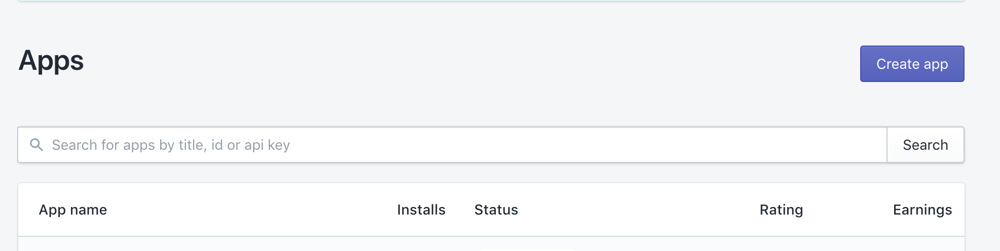

## Inital set up of our app

#### Step 1. Install the latest version of Node.

Install the latest LTS version of node from the
[official site](https://nodejs.org/en/). This will include the npm client we'll
use to install dependencies `nvm use 8.11.3` (as of writing this 8.11.3 is
currently the stable version)

FYI: use `nvm current` to see what version of node you’re using. Use `nvm ls` to
see what the latest version. Use `nvm --help` to see all commands

---

#### Step 2. Add package.json

We will be using the command line to build up our app! From whatever directory
you work from type

```bash
 npm init
```

You'll then be asked to answer some questions via the command line to build your
`package.json` file:

Example: name: (example-app) <- your repo name is the default will become:

```json
{"name": "example-app"}
```

in your `package.json` file

---

#### Step 3. Add .gitignore and ignore node_modules

Add a `.gitignore` file at the same level as your package.json. add:

```
node_modules
.DS_Store
```

to the body of of this file. This will ensure you don't commit a bunch of
packages you don't need to track on git. We will add more to this file later.

---

#### Step 4. Add yarn

We will be using [yarn](https://yarnpkg.com/en/docs/install#mac-stable) in this
guide, but you're welcome to continue using `npm` if you prefer it.

Head to: https://yarnpkg.com/en/docs/install#mac-stable to install `yarn`.

Once yarn is installed, run

```bash
yarn
```

`yarn` will install a `yarn.lock` file in the root of your directory.

---

#### Step 5. Add babel, add webpack, configure webpack to use babel-loader.

We want to run our js files through the babel-loader so that we can use modern
JS syntax. This package transpiles our Javascript through webpack!

We’ll use webpack 4 for this. [Webpack](https://webpack.js.org/) is an
open-source Javascript module bundler. It consumes your client side code,
traverses it’s dependencies, and generates static assets representing those
modules. So, add [webpack](https://webpack.js.org/) and
[webpack-cli](https://webpack.js.org/api/cli/):

```bash
yarn add webpack webpack-cli
```

Install [babel](https://babeljs.io/en/setup#installation) - At the time of
writing this guide, babel gives you an interface to choose your desired set up.
We want to use webpack, so after selecting that our command would be:

ie: Choose your tool -> webpack Installation ->

```bash
yarn add babel-loader babel-core
```

Create `webpack.config.js` on the same level as our other files file and add:

```js
module.exports = {
  module: {
    rules: [
      {
        test: /\.(js|jsx)$/,
        exclude: /node_modules/,
        use: ['babel-loader'],
      },
    ],
  },
};
```

Create a `.babelrc` file and add some plugins:

```bash
yarn add babel-preset-env
```

FYI: For more information see
[https://babeljs.io/docs/en/babel-preset-env/](https://babeljs.io/docs/en/babel-preset-env/)

In order to enable the preset you have to define it in your .babelrc file, like
this:

```js
  {
  "presets": [
    "env"
  ]
}
```

We then want to specific which _stage_ of babel presets you want to use. Lets
use stage 2 for this. You can read more about stage 2
[here](https://babeljs.io/docs/en/babel-preset-stage-2)

```bash
yarn add babel-preset-stage-2
```

in your .babelrc file:

```diff
  {
  "presets": [
    "env",
+   "stage-2"
  ]
}
```

---

#### Step 6. Set up partners dash dependencies

We're going to now add a place that we can keep our `API_KEY` and
`SHOPIFY_SECRET` tht are provided to us in the Partners dashboard. Storing
configuration in the environment separate from code is based on The
[Twelve-Factor App methodology](https://12factor.net/config).

Before creating a `.env` let’s add it to our `.gitignore`:

```diff
node_modules
.DS_Store
+.env
```

Let’s add a `.env` file at the same level as our other files

The `.env` file will contain:

```json
SHOPIFY_API_KEY='YOUR_SHOPIFY_API_KEY'
SHOPIFY_SECRET='YOUR_SHOPIFY_SECRET'
```

To get a Shopify API Key and Secret you need to create an app in the
[Partners Dashboard](https://www.shopify.ca/partners).

Once you're logged into the Shopify Partners dashboard click "Apps" from the
main dashboard navigation. Then click "Create app".


Give your app a name, this can be anything you'd like. We will call our app
`cool-fun-example app`. It requires a url, so you can just put a placeholder there for the time being. We will eventually add our `ngrok` tunnel address in it's place. The interface will provide you both an `API_KEY` and
`SHOPIFY_SECRET`. Add those to the key value pairs in your `.env` file.

Next, we're going to add the `dotenv` package:

```bash
yarn add dotenv
```

Dotenv is a zero-dependency module that loads environment variables from a .env
file into
[process.env](https://nodejs.org/docs/latest/api/process.html#process_process_env).
This will help us later when we need to use our API key and secret variables.

---

#### Step 7. Add Dev Dependencies

#### [Babel-cli](http://babeljs.io/docs/en/babel-cli/)

Babel cli allows you to compile files on the fly from the command line and is
useful to create build scripts and deploy.

```bash
yarn add --dev babel-cli
```

#### Nodemon

nodemon is a tool that helps develop node.js based applications by automatically
restarting the node application when file changes in the directory are detected.

```bash
yarn add --dev nodemon
```

#### Prettier

Prettier is a package that helps keep your code clean and easy to read. It can
be very helpful for projects with many developers working in the same files. No
fights over spaces vs tabs because it's all preconfigured! You don't need to use
prettier, but this is the config we use at Shopify:

```bash
yarn add --dev prettier
```

create a `.prettierrc` file and add:

```json
{
  "arrowParens": "always",
  "singleQuote": true,
  "bracketSpacing": false,
  "trailingComma": "all"
}
```

---

#### Step 8. Some extras

Let’s add an editor config file, do we need this?

https://github.com/Shopify/unite-react-node-app-workshop/blob/master/.editorconfig

---

More info:

- [babel](https://babeljs.io/) lets us use modern syntax and JSX everywhere
- [webpack](https://webpack.js.org/) compiles our client-side code into a bundle
- [prettier](https://prettier.io/) make our code look pretty and maintains
  consistency
- [dotenv](https://github.com/motdotla/dotenv) helps configure our environment
  variables
- [koa](https://koajs.com/) minimalistic and modern node server framework
